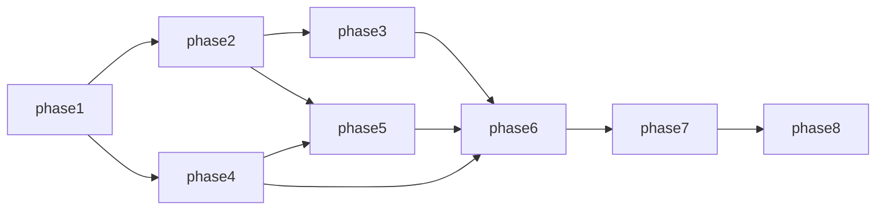

# Roadmap: SRF News German Learning

Master-Reihenfolge der Arbeit. Einstieg und Finalisierung: [README.md](./README.md). Jede Phase verlinkt auf Kontext, DoD und Issues.

| Order | Phase | Kurzbeschreibung | Link |
|------:|--------|------------------|------|
| 1 | Fundament | Repo-Layout, Docker Compose, Flask-Skelett, Health, Ruff/Prettier, CI auf PR und Push | [./phase-1/README.md](./phase-1/README.md) |
| 2 | Datenbank app.db | Schema, Wörterbuch- und Artikel-API (nur DB), FTS, Einstellungen | [./phase-2/README.md](./phase-2/README.md) |
| 3 | SRG Upstream | OAuth2 Client Credentials, Refresh mit 15-Min-Cooldown, Ingest | [./phase-3/README.md](./phase-3/README.md) |
| 4 | Ollama Lifecycle | Sidecar Start/Stop, Idle, Warnung, Sleep, SSE-Grundlage | [./phase-4/README.md](./phase-4/README.md) |
| 5 | Vektoren und LLM | sqlite-vec, Embeddings, Retrieval, Vereinfachen inkl. Stream | [./phase-5/README.md](./phase-5/README.md) |
| 6 | Vue Frontend | PrimeVue Aura, Tailwind, News, Wörterbuch, Settings, Realtime-UX; optional P6-I06 PONS On-Demand | [./phase-6/README.md](./phase-6/README.md) |
| 7 | Qualität und Betrieb | pytest/Vitest Edge Cases, ruff, CI optional, README | [./phase-7/README.md](./phase-7/README.md) |
| 8 | Multi-Provider News | Mehrere Upstreams per `.env`, NewsAPI.org, Quelle in UI, LLM-Übersetzung, abschliessender Projekt-Rename | [./phase-8/README.md](./phase-8/README.md) |

## Abhängigkeiten zwischen Phasen

Phase 4 kann nach Phase 1 parallel zu Phase 2 beginnen (getrennte Oberflächen), endgültige Integration von Phase 5 braucht Phase 2 und 4.

## Review und Finalisierung (2026-05-09)

- **Abdeckung:** Sieben Phasen, 25 Issue-Specs (darunter ein optionales P6-I06); Abhängigkeiten zwischen Specs per relativem Link geprüft; Cross-Phase-Links nutzen `../../phase-M/issues/...`.
- **Phase 8 (2026-05-10):** Acht Issue-Specs unter [phase-8/README.md](./phase-8/README.md); baut auf Phase 2–7 auf (`P7 → P8`). **Nur Dokumentation** in der Planungs-PR; Umsetzung folgt in separaten Branches.
- **Kritischer Pfad:** `P1 → P2 → P3` und parallel `P1 → P4`; danach `P5` (braucht `P2` + `P4`); `P6` nach funktionalen Backend-Endpunkten; `P7` als Qualitäts-Abschluss; `P8` für Multi-Provider und Rebranding-Pfad.
- **Explizite Blocker:** [P3-I03](./phase-3/issues/P3-I03-news-refresh-ingest.md) setzt voraus, dass [P3-I02](./phase-3/issues/P3-I02-articles-api-mapping.md) abgeschlossen ist (Mapping-Dokument und Parser-Fixtures).
- **Bewusste Annahme:** Lokale und CI-Tests nutzen Mocks für SRG und Ollama, wo Specs „ohne Netzwerk“ fordern; echte Container-Integration bleibt manuell oder optional `integration`-Marker.
- **Nächster Schritt ausserhalb der Specs:** Tracker-Issues anlegen und Permalinks in den Issue-Bodies setzen (siehe [agents-docs/collaboration.md](../agents-docs/collaboration.md)).
