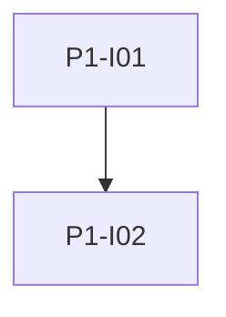

# Phase 1: Fundament

**Endzustand:** Vom Repository-Root startet der Stack mit `docker compose up` bzw. `docker compose up -d`; der Web-Container liefert einen verifizierbaren Health-Endpoint; lokales Backend-Setup ist mit `venv` und `requirements.txt` dokumentiert.

## DoD

- [ ] `docker-compose.yml` (oder `compose.yaml`) im Projektroot; `docker compose config` ohne Fehler.
- [ ] `docker compose up` zeigt Logs; `docker compose up -d` startet detached; `docker compose down` ohne `-v` erhält Daten-Volumes falls schon definiert.
- [ ] `GET /api/health` (oder gleichwertig) im Web-Image antwortet mit JSON und HTTP 200 in einem Smoke-Test (manuell oder Skript).
- [ ] README-Abschnitt: `python -m venv`, `pip install -r requirements.txt` für das Backend-Verzeichnis.

## Issues

| ID | Titel | Spec |
|----|--------|------|
| P1-I01 | Monorepo-Layout und Docker Compose | [issues/P1-I01-monorepo-docker-compose.md](./issues/P1-I01-monorepo-docker-compose.md) |
| P1-I02 | Flask App Factory und Health | [issues/P1-I02-flask-venv-health.md](./issues/P1-I02-flask-venv-health.md) |

## Issue-Graph

