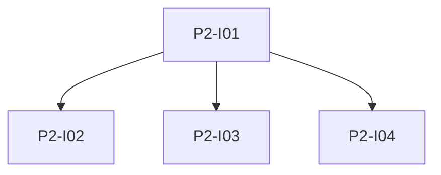

# Phase 2: Datenbank app.db und Basis-API

**Endzustand:** `app.db` enthält das vereinbarte Schema für Artikel, Wörter, Verknüpfungen, Einstellungen und FTS; REST-Endpunkte lesen und schreiben Wörter sowie Artikel ausschliesslich aus der DB (noch ohne SRG-Upstream).

## DoD

- [ ] Schema und Migrationen (oder ein dokumentierter Initialisierungspfad) liegen im Repo; frische `app.db` lässt sich erzeugen.
- [ ] Wörterbuch-CRUD per API mit Tests; Artikel-List/Detail aus DB mit Paginierung/Filter wie in der Spec.
- [ ] FTS5 für Titelsuche funktioniert mit mindestens einem pytest-Fall.
- [ ] Einstellungen (z. B. Übersetzungssprache) persistieren in `app.db`.

## Issues

| ID | Titel | Spec |
|----|--------|------|
| P2-I01 | app.db Schema und Migrationen | [issues/P2-I01-app-db-schema.md](./issues/P2-I01-app-db-schema.md) |
| P2-I02 | Wörterbuch REST API | [issues/P2-I02-words-api.md](./issues/P2-I02-words-api.md) |
| P2-I03 | Artikel lesen und FTS | [issues/P2-I03-articles-read-fts.md](./issues/P2-I03-articles-read-fts.md) |
| P2-I04 | Einstellungen API | [issues/P2-I04-settings-api.md](./issues/P2-I04-settings-api.md) |

## Issue-Graph

Abhängigkeit: Phase 1 abgeschlossen.
