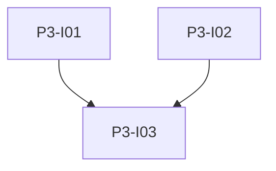

# Phase 3: SRG SSR Upstream

**Endzustand:** OAuth2 Client Credentials gegen `api.srgssr.ch`; Nutzerlöstes Refresh mit 15-Minuten-Sperre; Artikel werden in `app.db` gespeichert; Listen- und Detail-APIs lesen weiterhin nur aus der DB.

## DoD

- [ ] Token-Endpoint und Bearer-GETs gemäss SRG SSR Developer Portal; Token-Caching mit Ablauf.
- [ ] `POST /api/news/refresh` respektiert Cooldown; Response enthält bei Block `next_allowed_fetch_at` oder gleichwertig.
- [ ] Kein SRG-Call aus `GET /api/articles` ohne Refresh-Route.
- [ ] pytest deckt Cooldown-Grenzfälle ab (siehe Issue).

## Issues

| ID | Titel | Spec |
|----|--------|------|
| P3-I01 | SRG OAuth Client | [issues/P3-I01-srg-oauth-client.md](./issues/P3-I01-srg-oauth-client.md) |
| P3-I02 | Articles API Mapping und Felder | [issues/P3-I02-articles-api-mapping.md](./issues/P3-I02-articles-api-mapping.md) |
| P3-I03 | News Refresh und Ingest | [issues/P3-I03-news-refresh-ingest.md](./issues/P3-I03-news-refresh-ingest.md) |

## Issue-Graph

Abhängigkeit: Phase 2 abgeschlossen.
