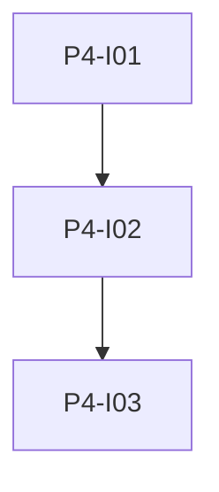

# Phase 4: Ollama Lifecycle und SSE

**Endzustand:** Sidecar steuert den Ollama-Container; Flask startet und stoppt über den Sidecar; Idle-Timer mit 60-Sekunden-Warnung und Abbruch; `GET /api/events/stream` liefert Status-Events; `POST /api/ollama/go-to-sleep` stoppt Ollama sofort.

## DoD

- [ ] Sidecar-Image oder Service dokumentiert; Web-Container hat keinen Docker-Socket gemountet.
- [ ] Ollama startet vor LLM/Embedding-Calls; Idle-Shutdown nach konfigurierbarer Zeit (Default 600 s).
- [ ] 60 s vor Shutdown wird ein SSE-Event gesendet; Cancel-Endpoint setzt den Timer zurück.
- [ ] SSE-Stream ist in einem Integrationstest oder manuell mit `curl` verifizierbar.

## Issues

| ID | Titel | Spec |
|----|--------|------|
| P4-I01 | Docker Sidecar Ollama | [issues/P4-I01-sidecar-ollama-docker.md](./issues/P4-I01-sidecar-ollama-docker.md) |
| P4-I02 | Idle Warnung Sleep und Cancel | [issues/P4-I02-ollama-idle-warning-sleep.md](./issues/P4-I02-ollama-idle-warning-sleep.md) |
| P4-I03 | SSE Event Stream | [issues/P4-I03-sse-event-stream.md](./issues/P4-I03-sse-event-stream.md) |

## Issue-Graph

Abhängigkeit: Phase 1 abgeschlossen.
