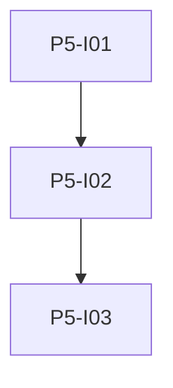

# Phase 5: Vektoren und LLM Vereinfachen

**Endzustand:** `vectors.db` mit sqlite-vec im Backend; Embeddings über `nomic-embed-text`; Top-K Retrieval vor dem Prompt; `POST` Vereinfachen mit Streaming-Events und Persistenz von Markdown, Wörtern und Vektoren für neue Einträge.

## DoD

- [x] sqlite-vec lädt im Web-Container (glibc-Image, PyPI-Wheel, amd64/arm64) mit Tests; kein Anwendungs-Fallback ohne Extension.
- [ ] Vereinfachen-Endpoint ruft Ollama mit CEFR-Level auf; strukturierte Antwort wird validiert und gespeichert.
- [ ] LLM-Stream erscheint als SSE-Events (oder festgelegter alternativer Transport laut Issue).
- [ ] pytest für leeres Lexikon, malformed Stream, Mindestanzahl neuer Wörter falls spezifiziert.

## Issues

| ID | Titel | Spec |
|----|--------|------|
| P5-I01 | sqlite-vec und vectors.db | [issues/P5-I01-sqlite-vec-vectors-db.md](./issues/P5-I01-sqlite-vec-vectors-db.md) |
| P5-I02 | Embeddings und Retrieval | [issues/P5-I02-embeddings-retrieval.md](./issues/P5-I02-embeddings-retrieval.md) |
| P5-I03 | Vereinfachen Stream und Persistenz | [issues/P5-I03-simplify-llm-stream.md](./issues/P5-I03-simplify-llm-stream.md) |

## Issue-Graph

Abhängigkeiten: Phase 2 und Phase 4 abgeschlossen. Issue **P5-I02** verlangt zudem **P4-I02** (Ollama Idle/Lifecycle), damit Starts für echte Embeddings reproduzierbar sind; Tests bleiben mockbar.
