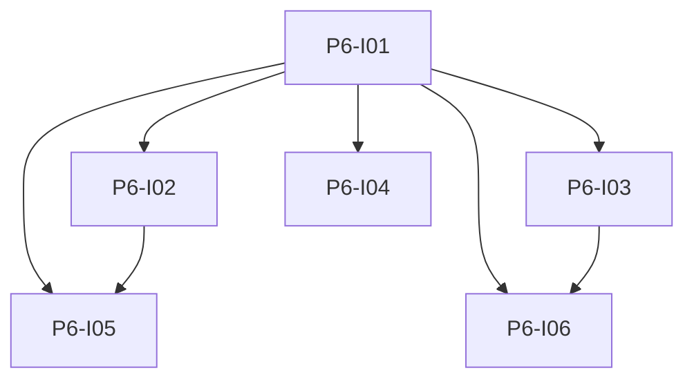

# Phase 6: Vue Frontend

**Endzustand:** SPA mit Vue 3, Vite, TypeScript, PrimeVue Aura, Tailwind 4; News-Ansicht mit Refresh, Datum, Suche; Wörterbuch; Einstellungen; SSE-Anbindung inkl. Spinner, Shutdown-Dialog, gestreamte LLM-Box und „Go to sleep“.

## DoD

- [ ] Produktionsbuild der SPA wird vom Backend oder statischem Server ausgeliefert (wie in Phase 1 festgelegt).
- [ ] Alle Kernflows sind auf Mobile nutzbar (manuelle Checkliste oder Playwright optional).
- [ ] EventSource verbindet auf `/api/events/stream`; Reconnect-Verhalten dokumentiert.
- [ ] Vitest für mindestens Store oder SSE-Helfer mit Edge Cases.

## Issues

| ID | Titel | Spec |
|----|--------|------|
| P6-I01 | Vue Tooling und App Shell | [issues/P6-I01-vue-tooling-shell.md](./issues/P6-I01-vue-tooling-shell.md) |
| P6-I02 | News UI | [issues/P6-I02-news-ui.md](./issues/P6-I02-news-ui.md) |
| P6-I03 | Wörterbuch UI | [issues/P6-I03-dictionary-ui.md](./issues/P6-I03-dictionary-ui.md) |
| P6-I04 | Einstellungen UI | [issues/P6-I04-settings-ui.md](./issues/P6-I04-settings-ui.md) |
| P6-I05 | Realtime Ollama und LLM UX | [issues/P6-I05-sse-ollama-stream-ux.md](./issues/P6-I05-sse-ollama-stream-ux.md) |
| P6-I06 | Optional PONS On-Demand und „Übersetzung anzeigen“ | [issues/P6-I06-optional-pons-on-demand.md](./issues/P6-I06-optional-pons-on-demand.md) |

## Issue-Graph

Abhängigkeiten: Phase 3, 4 und 5 funktional für End-to-End; P6-I01 kann früher nach Phase 1 starten. **P6-I06** ist optional und blockiert nichts.

## Optional nach MVP

- [P6-I06](./issues/P6-I06-optional-pons-on-demand.md): PONS nur auf Nutzeraktion; „Übersetzung anzeigen“ für noch leere Übersetzungsfelder.
