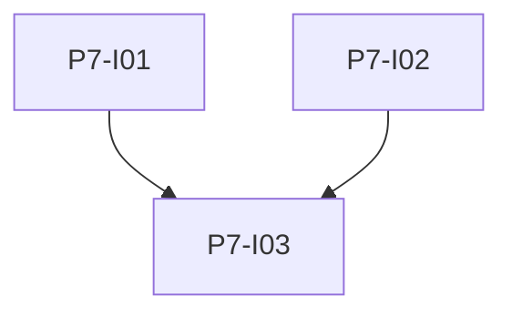

# Phase 7: Qualität und Betrieb

**Endzustand:** Ruff (und optional mypy) im Backend; pytest- und Vitest-Suites mit Edge Cases laufen in CI oder sind per Dokumentation ein Befehl; README beschreibt Start, Tests und Konfiguration.

## DoD

- [ ] `pytest` ohne Netzwerk-Marker grün (oder dokumentierte Marker-Strategie).
- [ ] `pnpm test` / `npm test` für Vitest grün.
- [ ] `ruff check` (und `ruff format --check` falls gewünscht) grün.
- [ ] README: Docker vom Root, venv, Umgebungsvariablen, wo `app.db` und `vectors.db` liegen.

## Issues

| ID | Titel | Spec |
|----|--------|------|
| P7-I01 | Backend Test Suite | [issues/P7-I01-pytest-suite.md](./issues/P7-I01-pytest-suite.md) |
| P7-I02 | Frontend Test Suite | [issues/P7-I02-vitest-suite.md](./issues/P7-I02-vitest-suite.md) |
| P7-I03 | Lint CI und README | [issues/P7-I03-ruff-ci-readme.md](./issues/P7-I03-ruff-ci-readme.md) |

## Issue-Graph

Abhängigkeit: Phase 6 für sinnvolle Frontend-Tests; Backend-Tests können parallel zur Feature-Entwicklung wachsen.
