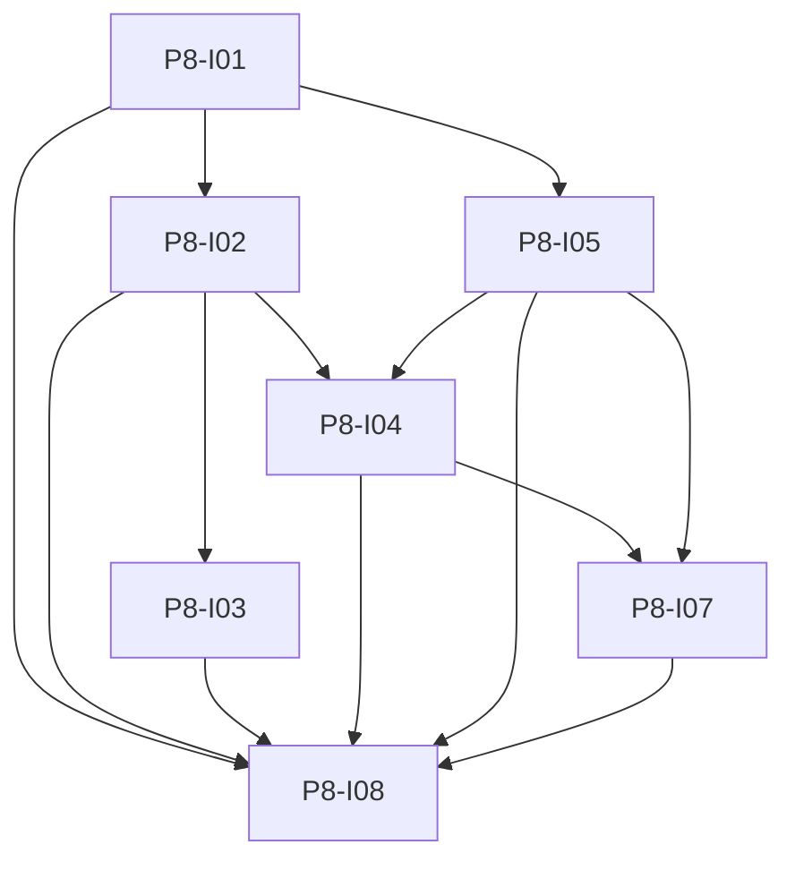

# Phase 8: Multi-Provider News und Rebranding

**Dieser Ordner enthält ausschliesslich Spezifikationen (Markdown).** Umsetzung erfolgt in separaten Feature-Branches und Issues; kein Anwendungscode in der Planungs-PR.

**Endzustand:** Mehrere konfigurierbare News-Upstreams (mindestens SRGSSR Articles API und NewsAPI.org), Umschalten per Umgebungsvariablen; jeder Artikel hat eine sichtbare **`news_provider`**-Kennung in API und UI; Cooldown und technische IDs sind pro Provider korrekt; LLM-Vereinfachen übersetzt fremdsprachige Artikel ins Deutsche; **abschliessend** separates Issue für repo-weiten Projekt-Rename (Compose, Pakete, Doku) unter dem Namen **News-Language-Lern** (Arbeitstitel, final in [P8-I08](./issues/P8-I08-repo-wide-project-rename.md)). SRGSSR bleibt ein **Vendor-News-Provider**, nicht der Produktname.

## DoD (nach Umsetzung aller Specs)

- [ ] `NEWS_ACTIVE_PROVIDER` (oder gleichwertiger Name) und Provider-Credentials in `backend/.env.example` und Compose dokumentiert.
- [ ] `POST /api/news/refresh` nutzt den konfigurierten Adapter; NewsAPI mit `httpx` und `X-Api-Key`-Header ([NewsAPI Authentication](https://newsapi.org/docs/authentication)).
- [ ] Artikel-API liefert `news_provider`; Frontend zeigt Herkunft in Liste und Detail.
- [ ] Cooldown pro Provider-Metadaten-Key; Wechsel des aktiven Providers blockiert den neuen Provider nicht durch den alten Cooldown.
- [ ] pytest ohne Netzwerk für neue Pfade grün (Mocks/Fakes).
- [ ] P8-I08 erst nach I01–I07; ein klarer Rename-PR ohne Feature-Mix.

## Issues

| ID | Titel | Spec |
|----|--------|------|
| P8-I01 | Env, aktiver Ingest-Provider, Artikel-`news_provider` | [issues/P8-I01-env-active-provider-and-article-news-provider.md](./issues/P8-I01-env-active-provider-and-article-news-provider.md) |
| P8-I02 | News-Refresh: Upstream-Port und Adapter | [issues/P8-I02-news-refresh-upstream-port-adapter.md](./issues/P8-I02-news-refresh-upstream-port-adapter.md) |
| P8-I03 | Cooldown-Metadaten pro Provider | [issues/P8-I03-per-provider-cooldown-metadata.md](./issues/P8-I03-per-provider-cooldown-metadata.md) |
| P8-I04 | NewsAPI.org Client und Mapping | [issues/P8-I04-newsapi-org-client-and-mapping.md](./issues/P8-I04-newsapi-org-client-and-mapping.md) |
| P8-I05 | `external_id` und Eindeutigkeit | [issues/P8-I05-external-id-and-uniqueness.md](./issues/P8-I05-external-id-and-uniqueness.md) |
| P8-I07 | LLM: nicht-deutsch → Deutsch + CEFR | [issues/P8-I07-llm-translate-non-german-articles.md](./issues/P8-I07-llm-translate-non-german-articles.md) |
| P8-I08 | Repo-weiter Projekt-Rename (letztes Issue) | [issues/P8-I08-repo-wide-project-rename.md](./issues/P8-I08-repo-wide-project-rename.md) |

## Issue-Graph

**Hinweis:** I08 hängt inhaltlich von allen vorherigen Issues ab und wird zuletzt umgesetzt (ein Rename-Track).

## Abhängigkeiten zu früheren Phasen

- [Phase 2](../phase-2/README.md): Artikel-Schema und Lesen-API ([P2-I03](../phase-2/issues/P2-I03-articles-read-fts.md)).
- [Phase 3](../phase-3/README.md): News-Refresh und SRGSSR-Ingest ([P3-I03](../phase-3/issues/P3-I03-news-refresh-ingest.md)).
- [Phase 5](../phase-5/README.md): Vereinfachen-Stream ([P5-I03](../phase-5/issues/P5-I03-simplify-llm-stream.md)); Referenzcode `backend/app/articles/simplify_service.py`.
- [Phase 6](../phase-6/README.md): News-UI für Badges und Kopiervorlagen.

## Out of scope (Phase 8)

- Hintergrund-Cron für Refresh.
- Persistente UI-Einstellung des Ingest-Providers (statt `.env`): nicht Minimalumfang; Ops-Konfiguration reicht.
